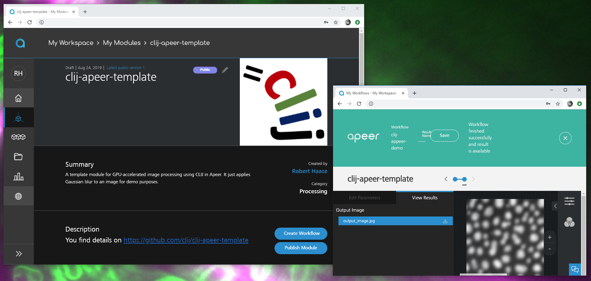

# clij-apeer-template
This repository contains an example module for 
[Apeer](https://apeer.com)
 running GPU-accelerated image proessing using 
[CLIJ](https:///clij.github.io).



## Usage
In order to build your workflows using CLIJ in Apeer, clone this repository and sync it with the folder you downloaded from Apeers git.

```bash
git clone https://github.com/clij/clij-apeer-template
```

Modify the code according to your needs. For example, you can enter your particular image processing workflow 
[here](https://github.com/clij/clij-apeer-template/blob/master/src/main/java/net/haesleinhuepf/clapeer/GaussianBlur.java#L36).

If you change the jar filename in the pom.xml, keep in mind you also need to change it in the dockerfile accordingly.

[Back to CLIJ documentation](https://clij.github.io/)

[Imprint](https://clij.github.io/imprint)
